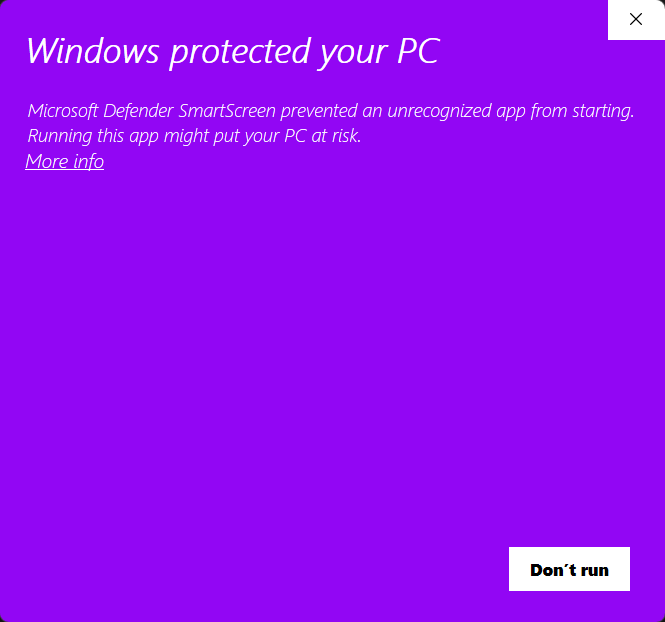
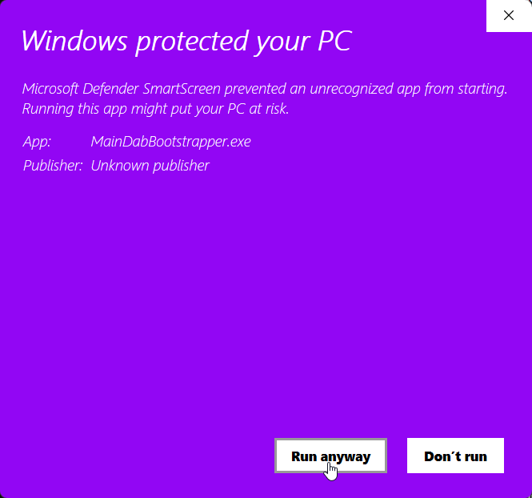

# Downloading MainDab's Bootstrapper

### Downloading MainDab's Bootstrapper

You can get MainDab's downloader from our [Discord server](https://discord.io/maindab) or from [here](https://github.com/MainDabRblx/ProjectDab/blob/master/MainDabBootstrapper.exe?raw=true).\
\
It will download as an `.exe` file.

Now, click it in order to run MainDab's Bootstrapper. You may get an error warning that Windows has protected your PC. It looks something like this :

Click "More info", then click "Run anyway".

That's all! The bootstrapper will automatically download and run MainDab for you.

