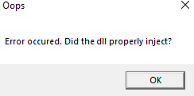

# Error occured. Did the DLL properly inject?

### Fix

Close (restart) both MainDab and Roblox. If that does not work, that means that Roblox has updated, and you must wait until the APIs update.


​​lf you keep encountering this error, it may mean the API isn't updated. Wait for the API to be updated (usually a few hours)\
\
For extra help, join [MainDab's Discord](https://discord.io/maindab).

